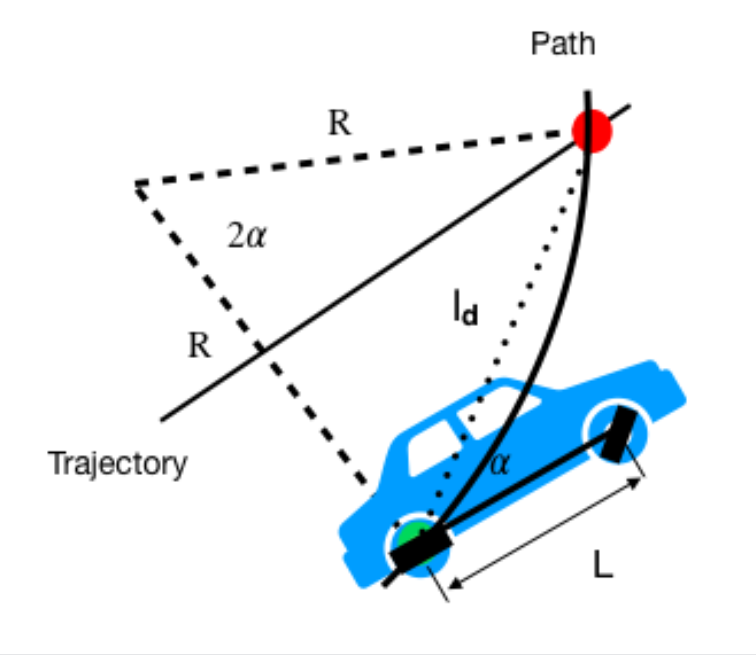
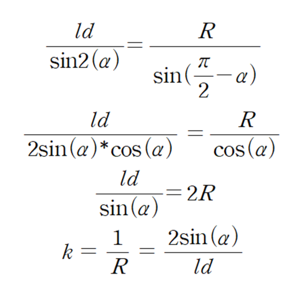
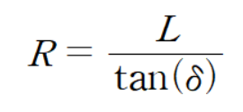
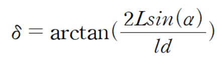

# MATLAB-Based Real-Time Control System

## Introduction

### Controller Design and Real-Time Control Using MATLAB

This project integrates road and traffic sign information, as well as target waypoints obtained from deep learning perception models and path planning algorithms, to implement a real-time vehicle control system.

The control system was built using **MATLAB and Simulink**, leveraging their block-based modeling environment in conjunction with **ROS2** communication.  
The key advantages of using MATLAB/Simulink include:

- **Optimized for numerical analysis and control tuning**: Enables rapid iteration of controller parameter adjustment and system response evaluation  
- **Visual controller design with Simulink**: Supports intuitive block-diagram modeling of controllers like Pure Pursuit, PID, and MPC  
- **Native ROS2 integration**: Allows seamless subscription to perception/planning modules via ROS2 topics  
- **Automatic code generation**: Designed models can be compiled into C/C++ and deployed on embedded vehicle controllers

In this system, a **Pure Pursuit controller** is used to compute the steering angle in real time, based on the vehicle’s position, target waypoints, and velocity.

- **Input**: current vehicle position, upcoming waypoints  
- **Output**: steering angle, published as control commands  
- **Control frequency**: 100Hz (0.01s) — optimized for low-speed RC-scale vehicles, offering a balance between reactivity and computational efficiency  
- **Lookahead distance**: 1 meter

---

## Key Components

### YOLOv8-Based Traffic Sign Detection + Stateflow-Driven Vehicle State Transitions

Traffic signs such as Stop signs and traffic lights are detected using a YOLOv8-based perception node.  
Detected signals are published via ROS2 topics and subscribed to within Simulink’s **Stateflow** block, where vehicle states (e.g., driving, stopping, slowing) are automatically transitioned.  
This same mechanism is used to stop the vehicle at predefined pick & drop locations.

**Example**:  
YOLOv8 detects Stop Sign → Publishes to `/traffic_signal` topic → Simulink subscribes → State transitions: driving → stop

---

### Lane-Following via SCNN + Pure Pursuit

Lane markings are detected using SCNN (Spatial CNN), which extracts centerlines from input images.  
Additionally, waypoints are generated by RRT and reinforcement learning-based path planning algorithms.  
These waypoints are fed into the **Pure Pursuit controller** in Simulink to compute real-time steering commands for smooth path tracking.

**Pure Pursuit Steering Calculation (Conceptual)**:

- `L`: Vehicle length  
- `δ`: Steering angle  
- `α`: Heading angle between vehicle and target point  
- `Ld`: Distance between rear axle and lookahead point  
- `R`: Turning radius (computed from circular arc through the points)

---

### RRT-Based Path Refinement and Spline Smoothing

Paths generated using RRT consist of sparse, discontinuous nodes, which are unsuitable for direct control.  
To address this, we applied **cubic spline interpolation** to convert node-based paths into smooth curves.  
This allowed the vehicle to follow realistic trajectories and enabled the controller to operate on continuous input data.

---

### ROS2 ↔ Simulink Communication Structure

All perception and planning modules (e.g., YOLOv8, SCNN, RRT) operate as **ROS2 publishers**, continuously sending real-time data via topics.  
Simulink receives these messages via **ROS2 Subscribe blocks**, enabling real-time feedback control based on perception outputs.

Control components such as Stateflow (vehicle states), Pure Pursuit (steering)

---

## Features

### Pure Pursuit Controller

Pure Pursuit is a lightweight geometric path tracking algorithm that calculates the required steering angle to follow a lookahead point on the path.  
It is highly effective in environments with predefined paths and static obstacles, such as ours.  
The method is simple to implement, computationally efficient, and naturally compatible with ROS2 and Simulink for real-time control integration.

### Why MATLAB/Simulink for Control?

- **Visual modeling environment**: Compared to C or Python, control logic can be clearly visualized and designed via blocks  
- **Official ROS2 support**: Real-time data communication via subscribe/publish blocks simplifies integration with sensors and external modules  
- **Unified platform**: From controller design to simulation, code generation, and deployment—all within a single toolchain  
- **Fast simulation-to-reality transition**: Ideal for seamless shift from development to hardware testing

---

## Dataset Structure

The control system uses the following key datasets:

- **Waypoints (x, y)**:  
  Generated from RRT and reinforcement learning planners.  
  These are used as inputs to the Pure Pursuit controller.

- **Cartographer-Based Localization (AMCL-style)**:  
  Vehicle’s real-time position and heading are estimated using Cartographer on a prebuilt static map.  
  This functions similarly to AMCL localization (not full SLAM) and is used for coordinate transformation and heading correction.

- **SCNN Lane Center Coordinates (x, y)**:  
  Output of the SCNN lane detection model, providing lane centerlines.  
  Used in parallel with waypoints for enhanced tracking and validation.

- **YOLOv8s Traffic Signal Output**:  
  Detected traffic signs (e.g., Stop, Pick, Drop) are published to ROS2 and subscribed to in Simulink.  
  These signals drive vehicle behavior transitions (e.g., stop/go) via Stateflow logic.

---

## ROS2 Integration

### ROS2-to-Simulink Data Flow

All inputs to the control system are ROS2-published topics subscribed to by Simulink in real time.  
This enables continuous integration between the perception, planning, and control modules.

**ROS2 Topics Used**:

- `SCNN → /waypoints_x`, `/waypoints_y` (`std_msgs/Float32MultiArray`)  
  → Lane centerlines represented as waypoints

- `YOLOv8 → /stop_index` (`Int32`)  
  → Stop signals, traffic lights, pick/drop indicators

- `Localization → /pose` (`geometry_msgs/PoseWithCovarianceStamped`)  
  → Real-time vehicle position and orientation from Cartographer (AMCL-style)

**Control Loop Execution**:  
Simulink subscribes to these topics and computes steering commands using the Pure Pursuit controller, which are then applied to the vehicle in simulation or hardware.

---

