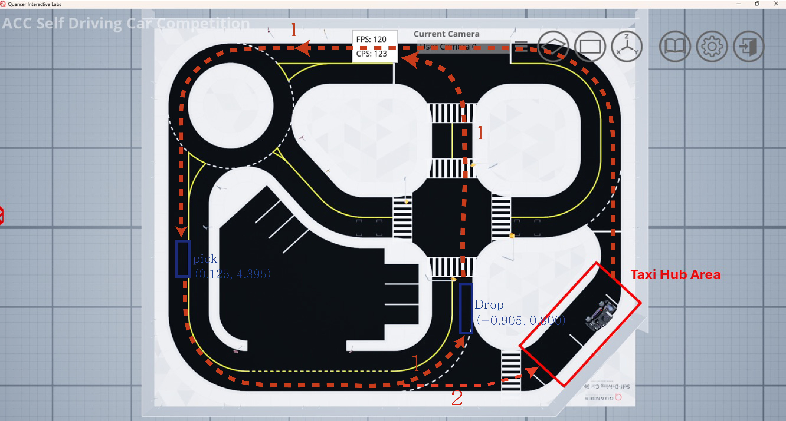

# Planning

## Introduction

### Scenario-Based Path Planning System for Autonomous Vehicles

This project implements a scenario-based path planning system that enables an autonomous vehicle to determine the optimal route from a starting point to a destination within complex road structures.  
Beyond simple path generation, the system incorporates traffic rules and environmental context into the decision-making process, combining them with reinforcement learning (RL) to build a route selection policy.

---

### 1. Road Area Segmentation and Environment Mapping

The driving track used is from the Quanser Self-Driving Car Studio simulation environment.  
On the pixel-based map, road and off-road regions were clearly separated, with off-road areas marked as inaccessible.  
Then, the pixel coordinate system was aligned 1:1 with real-world maps obtained from Cartographer SLAM and QLabs-based driving scenarios to ensure consistent spatial matching.

---

### 2. Grid World State Space Definition

The pixel map was divided into fixed-size blocks (e.g., 10x10 pixels) to create a **Grid World** environment.  
Each grid cell represents a potential vehicle state and includes properties such as road presence, obstacles, and destination metadata.  
Within this space, **RRT (Rapidly-exploring Random Tree)** was used to generate path candidates, connecting only valid nodes inside the road area.

---

### 3. RRT → Spline Interpolation → Waypoint Generation

Since RRT generates sparse, discrete points, **cubic spline interpolation** was applied to each path to produce continuous, physically feasible routes.  
The interpolated paths were stored as **waypoint lists**, where each waypoint corresponds to a meaningful vehicle position.  
In complex areas (e.g., intersections or multi-lane roads), all possible movement options (straight, left turn, right turn) were precomputed and stored.

---

### 4. Destination-Based Path Selection via Reinforcement Learning

Given a pickup and drop-off location within a predefined scenario, the path selection problem was modeled using reinforcement learning.

**RL Components**:
- **State**: Current vehicle position (grid), goal position, surrounding road conditions  
- **Action**: Choose one among precomputed path candidates  
- **Reward**: Composite function including time to arrival, collisions, rule violations, and path length

---

### 5. Application to Preliminary Scenario

Due to the high computational cost and limited real-time stability of the current RL model, the preliminary competition scenario uses a static setup with precomputed RRT paths.  
Instead of dynamic online planning, the system selects an optimized route based on the fixed scenario.  
We plan to later extend this with a lightweight, online-capable RL model for real-time planning.

---

## Features

- Pre-generation of all possible waypoint-to-waypoint routes allows flexible path selection  
- Weighted graph representation enables shortest-path search based on costs or traffic priorities  
- Scenario-specific reward functions enable training of reinforcement learning policies  
- Modular structure allows swapping of planning strategies depending on conditions

---

## Dataset Structure

- **Map Data**: Binary-separated road/off-road grid-based environment  
- **RRT Path Data**: Precomputed connections between all waypoints within road boundaries  
- **Weighted Graph**: Cost and priority values assigned to each path segment  
- **Loss & Reward Functions**: Designed to support reinforcement learning feedback and training

---

## ROS2 Integration

The planning node utilizes learned policy weights, precomputed RRT paths, and map data to automatically select the optimal route between any two waypoints.  
Once a starting and goal waypoint are input, the system computes the best path and publishes it through ROS2 topics.  
The published waypoint sequence is then subscribed to by a **MATLAB-based control system**, which uses the data to generate steering and speed commands for vehicle execution.

---

