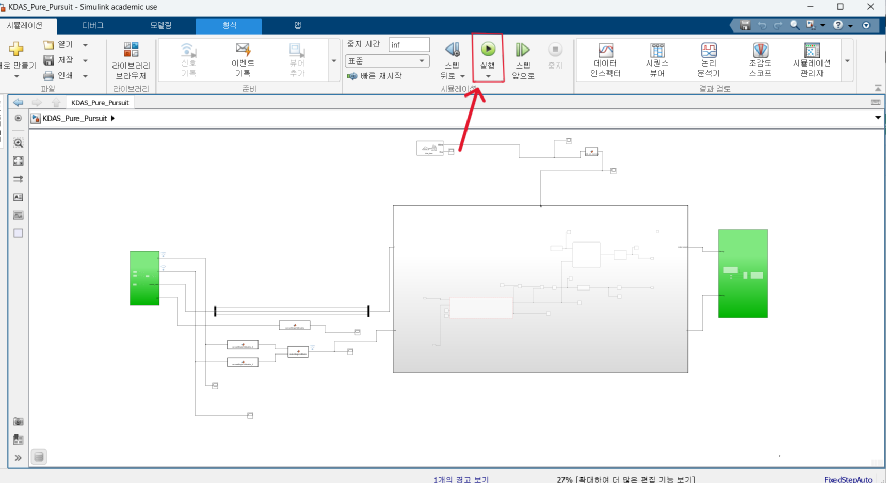

## Introduction

Hello.
This is the main project repository of the Kookmin University team.
This repository has been created for submission to the Quanser Autonomous Car Competition (ACC).
Detailed processes and research outcomes for each component are organized in their respective folders.

---

## Whole Project

These are GIF previews showcasing the research results of each module.
Click on each link to directly navigate to the corresponding folder containing the deliverables.

<table>
  <tr>
    <td align="center">
       
      <b>YOLO1</b> 
      <a href="YOLO/">(link)</a>
    </td>
    <td align="center">
       
      <b>YOLO2</b> 
      <a href="YOLO/">(link)</a>
    </td>
  </tr>
  <tr>
    <td align="center">
       
      <b>SCNN</b> 
      <a href="SCNN/">(link)</a>
    </td>
    <td align="center">
       
      <b>Control</b> 
      <a href="Control/">(link)</a>
    </td>
  </tr>
</table>

---

### Project Modules Overview

- [**P1 – Control**](P1/)  
  **Summary:** Receives all system data and performs autonomous vehicle actions such as stopping and trajectory following using controllers like **Stateflow** and **Pure Pursuit**.

- [**P2 – Planning**](P2/)  
  **Summary:** Implements a path planning algorithm to select the optimal driving route when multiple options are available during autonomous navigation.

- [**P3 – SCNN**](P3/)  
  **Summary:** Uses the **SCNN model** to detect lanes and compute centerlines for lane-following behavior during autonomous driving.

- [**P4 – YOLO**](P4/)  
  **Summary:** Applies the **YOLO object detection model** to recognize traffic signs and signals in real time and link them to the control system.

---

## ⚠️ Important Notes Before Running the System

1. **Download all attached files** and **configure the file paths** according to your local environment.
2. Prepare the **ROS 2 launch files and corresponding Simulink models** for each algorithm or module.
3. **Please follow the execution order strictly**:
   -  First, **click the `Run` button in Simulink** to start the simulation.
   -  Then, **launch the remaining ROS 2 nodes**.
> ⚠️ Not following this order may lead to communication issues between Simulink and ROS 2.

4. Each node must be launched **individually**, and the **Cartographer node must be launched last**.
> ⚠️ Launching Cartographer before the others may result in incorrect TF tree initialization or data synchronization issues.
5. All `launch`, `build`, and `install` files are included within the `ros2` folder.

---

###Launch Order
Step1.  ros2 launch qcar2_nodes/launch
Cartographer_localization.py
(Wait until Cartographer has localized successfully.)

Step2. ros2 run yolo_detection/scr
yolo_node.py

Step3. ros2 run  launch lane_detection /launch
lane_detection_launch.py

Step4. 
**Run Simulink model**  
*(Start the Simulink control model before proceeding to the next steps.)*
