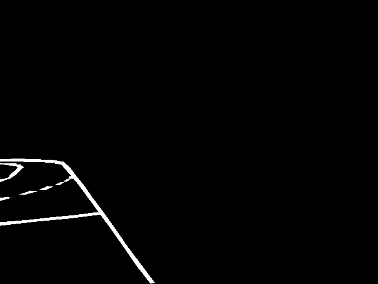

# SCNN

## Introduction

To ensure accurate lane-centered driving in autonomous vehicles, we adopted **Spatial Convolutional Neural Networks (SCNN)** as our primary lane detection model.  
Unlike conventional CNNs, SCNN propagates spatial information across rows and columns, enabling robust recognition of continuous lanes even under occlusions or curvature.

The SCNN model was trained on custom-labeled QLab video frames. When lanes are detected, the model estimates the left and right boundaries and calculates the centerline using polynomial fitting.  
Centerline pixel coordinates are then transformed into global coordinates and published through ROS2.  
These coordinates are used as waypoints by a MATLAB-based vehicle control system.

---

## Why SCNN?

Compared to models like **Ultra-Fast Lane Detection** or **PolyLaneNet**, SCNN was chosen due to its:

- Effective spatial message passing that handles broken or curved lanes well  
- Simpler architecture that supports real-time performance  
- Better interpretability and postprocessing compatibility for custom pipelines  
- Strong performance on limited or simulated datasets such as QLab scenes

---

## Features

- Spatial feature propagation across rows and columns  
- Accurate detection of continuous or partially occluded lane lines  
- Lightweight and efficient enough for ROS2-based real-time integration  
- Seamless postprocessing and coordinate transformation

---

## Dataset Structure

The dataset was created from QLab driving footage. Each input RGB image is paired with a binary segmentation mask:

- Lane pixels are white, background is black  
- Only lane markings are labeled in the mask  
- All labels follow a binary (0/1) convention for semantic segmentation  
- Dataset is split 80% for training, 20% for validation, Testing was conducted directly within the QLabs simulation environment,  
so a separate test dataset was not included.

<table>
  <tr>
    <td align="center">
       
    </td>
    <td align="center">
       
    </td>
  </tr>
  <tr>
    <td align="center">
       
    </td>
    <td align="center">
       
    </td>
  </tr>
</table>

---

## Postprocessing

The SCNN output mask undergoes several postprocessing steps:

- Lane points are clustered using a row-wise DBSCAN approach  
- Left and right lanes are identified and spline curves are fitted  
- A centerline is computed by averaging the splines  
- These centerline pixel points are converted to global coordinates using camera intrinsics and depth estimation

---

## Test Results

The trained SCNN model was evaluated on validation data generated in QLab simulation.  
Test results confirmed that the model reliably detects lane structures and produces smooth and usable centerlines.

- The segmentation masks accurately follow both solid and dashed lane markings  
- Centerlines computed via spline fitting remained stable across frame sequences  
- Visual inspection shows consistent detection even in curves and partial occlusion scenarios

The generated centerlines were successfully converted to global coordinates and used as waypoints for real-time vehicle control in MATLAB.  
This confirmed the model’s reliability and usability in an end-to-end perception-to-control pipeline.

---

## ROS2 Integration

The postprocessed centerline coordinates are integrated with the ROS2 framework:

- The vehicle's pose is retrieved from Cartographer or a localization system  
- SCNN centerline points are transformed to global coordinates using the current pose  
- Waypoints are published via ROS2 topics  
- The MATLAB control system subscribes to these topics and uses the waypoints for trajectory planning and steering control

---

## Additional Files

- **SCNN trained model file**  
- **ROS2 node for real-time inference and waypoint publishing**
- **Build Files**  

