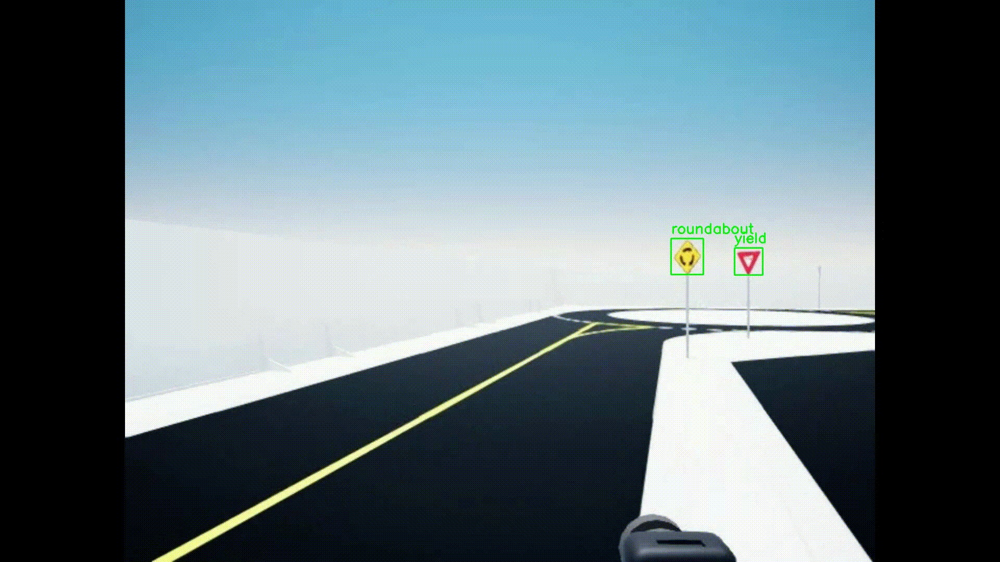

## Introduction

To recognize traffic lights and traffic signs during autonomous driving, we adopted the YOLO object detection model.  
YOLO models learn distinctive features of objects, optimize weights through training, and perform real-time detection using a single forward pass through the network.  
Among various YOLO versions, we selected **YOLOv8s** due to its excellent trade-off between computational efficiency and detection accuracy, making it ideal for deployment in real-time embedded systems.  

The trained PyTorch-based YOLOv8s model was deployed as a ROS2 node within our perception pipeline.  
Once an object is detected, its class ID is published via a ROS2 topic and consumed by the MATLAB-based control system to make corresponding behavioral decisions such as stopping, slowing down, or continuing navigation.

---

## Features

- Real-time detection of traffic-related objects in driving scenarios  
- Fast and lightweight model architecture (YOLOv8s) suited for edge deployment  
- High detection accuracy with low latency inference  
- Fully integrated into ROS2 for seamless message-based communication  
- Modular and extensible design allows easy adaptation to new object classes

---

## Dataset Structure

We constructed a custom training dataset using images collected from QLabs, a simulated environment tailored for autonomous driving research.  
The dataset focuses on five key traffic object classes relevant to the driving task:

- **roundabout**  
- **stop**  
- **crosswalk**  
- **yield**  
- **red sign**

Additional dataset details:

- Label format complies with YOLO convention: `<class> <x_center> <y_center> <width> <height>`  
- Dataset is split: 80% for training and 20% for validation, Testing was conducted directly within the QLabs simulation environment,  
so a separate test dataset was not included.
- All labels are normalized with respect to image width and height  

---

## Test Results

The trained YOLOv8s model was evaluated on the validation set and additional test scenes from QLabs.  
Both quantitative metrics and visual inspections demonstrated that the model performed reliably across various object classes and road conditions.  
Its ability to consistently detect and localize signs enabled smooth integration with our decision-making and control system.

---

## ROS2 Integration

The YOLOv8s model was integrated as a ROS2 node that performs real-time object detection and publishes detection results through ROS2 topics.  
These results are then used by the vehicle's control system to adapt its behavior accordingly.  

- Publishes a **Int32** value (`1`/`0`) when a `stop`, `crosswalk`, or `red sign` is detected  
- All detection results are received by the **MATLAB control system**, which subscribes to these topics and executes vehicle-level decision-making logic

---

## Additional Files

This repository contains the following files related to the YOLOv8s integration:

- **ROS2 inference node** implementation (`yolo_node.py`)  
- **Trained YOLOv8s weights** (`model.pt`)   
- **Example ROS2 launch file** for easy node deployment
- **Build Files** for ROS2

